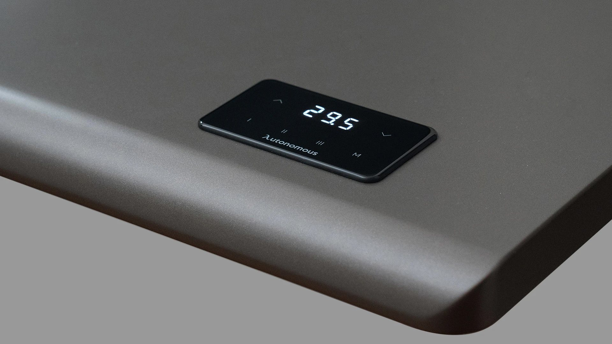

# Autonomous Desk



Whether you're learning, experimenting, or building your own version, the goal is to make advanced smart hardware accessible to everyone.


## What is this?

A smart desk you can build at home. Open hardware, open software. No paywall.

## Repo Layout

```
cad/            3D design files
  concept/      Sketches, ideas, early drafts
  source/       Editable CAD (Fusion 360, FreeCAD, SolidWorks)
  step/         STEP files (works in any CAD tool)
  stl/          STL files ready to 3D print
  drawings/     2D drawings, dimensions (PDF)

electronics/    All electronics stuff
  schematics/   Circuit diagrams
  pcb/          PCB design files (KiCad, Gerber)
  bom/          Parts list for electronics
  wiring/       Wiring diagrams, pinouts

firmware/       Code that runs on the desk (MCU, controller)

assembly/       How to build it
  photos/       Step-by-step photos
  videos/       Build videos (links or files)

docs/           Extra docs, guides, notes
bom/            Full bill of materials (all parts, prices, links)
tools/          Scripts, helper tools
examples/       Example usage, demo code
```

## Big Files: Git LFS

This repo uses **Git LFS** for CAD, STL, STEP, PCB, video, and PDF.
Install LFS once before you clone or push: see [docs/git-lfs.md](docs/git-lfs.md).

Quick:
```
brew install git-lfs     # macOS
git lfs install
git clone https://github.com/autonomous-ai/autonomous-desk.git
```

## Want to Build One?

1. Read [assembly/README.md](assembly/README.md) first
2. Get the parts from [bom/](bom/)
3. Print or order CAD parts from [cad/stl/](cad/stl/) or [cad/step/](cad/step/)
4. Build the electronics in [electronics/](electronics/)
5. Flash firmware from [firmware/](firmware/)
6. Follow the assembly steps

## Want to Help?

- Upload your CAD to [cad/source/](cad/source/) and export STEP + STL
- Add photos to [assembly/photos/](assembly/photos/)
- Open an Issue if something is broken or unclear
- Send a Pull Request with fixes or improvements

See [CONTRIBUTING.md](CONTRIBUTING.md) for details.

## License

- Hardware, CAD, docs → **[CC BY-NC-SA 4.0](LICENSE)**
- Firmware, code → **[PolyForm Noncommercial 1.0.0](LICENSE-CODE)**

Plain-English summary: **[LICENSE.md](LICENSE.md)**
